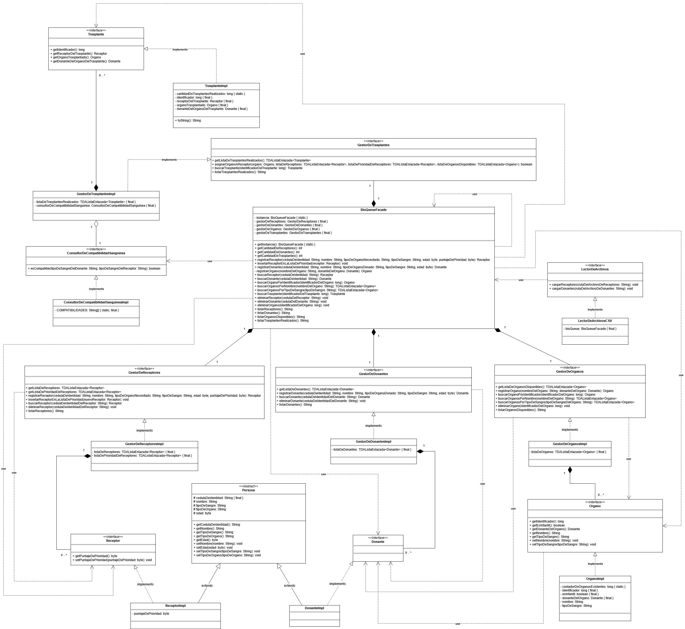
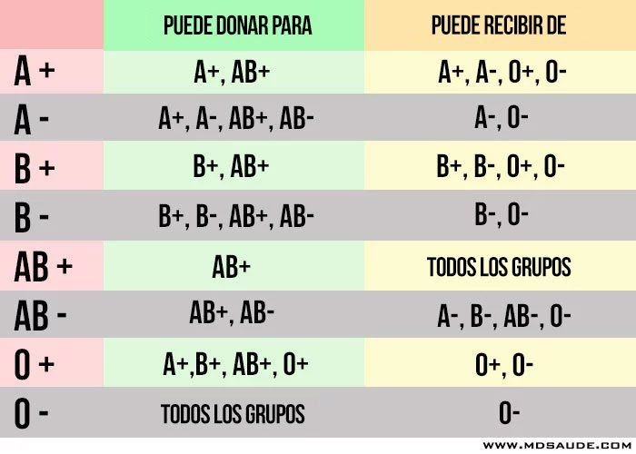

# 💻 Proyecto BioQueue - Grupo D (4) 💻

# Sistema de Gestión de Trasplantes de Órganos por Consola

## Integrantes

Axel Ferreira, Valentín Guerrico, Ianai Canias y Thiago Soca

## Descripción del Proyecto

BioQueue es un sistema de gestión de trasplantes de órganos que permite administrar donantes, receptores y órganos disponibles, así como mantener un registro de los trasplantes que se han realizado, automatizando el proceso de asignación de órganos según compatibilidad sanguínea y prioridad médica.

## Funcionalidades

- Registro de donantes y sus órganos.
- Registro de receptores con cola de prioridad por urgencia médica.
- Asignación automática de órganos según compatibilidad sanguínea.
- Historial de trasplantes realizados.
- Gestión de donantes, receptores, órganos y trasplantes realizados.

## Estructura del Proyecto

- `classes/` - Entidades del dominio (DonanteImpl, ReceptorImpl, OrganoImpl, TrasplanteImpl, Persona).
  - `Organo` verifica la compatibilidad sanguínea con el receptor.
  - `Trasplante` registra el historial de cada trasplante realizado.
- `interfaces/` - Contratos de cada entidad del sistema.
- `services/` - Lógica de negocio.
  - `GestorDeOrganos` - Administra los órganos disponibles.
  - `GestorDeReceptores` - Administra la cola de prioridad de receptores.
  - `GestorDeDonantes` - Administra la lista de donantes del sistema.
  - `GestorDeTrasplantes` - Orquesta la asignación de órganos y registra los trasplantes.
- `facade/` - Punto de entrada único al sistema (BioQueueFacade).
- `tda/` - Estructuras de datos propias (TDAListaEnlazada, TDAColaEnlazada).
- `Main` - Clase principal de funcionamiento del sistema.
- `ListaEnlazada, ColaEnlazada, Nodo` - Clases de estructuras de datos implementadas.

## Tecnologías Utilizadas

- Java.
- Maven.
- JUnit 5.

## Diagrama de Clases - UML

## Tabla de Compatibilidades Sanguíneas Utilizada

